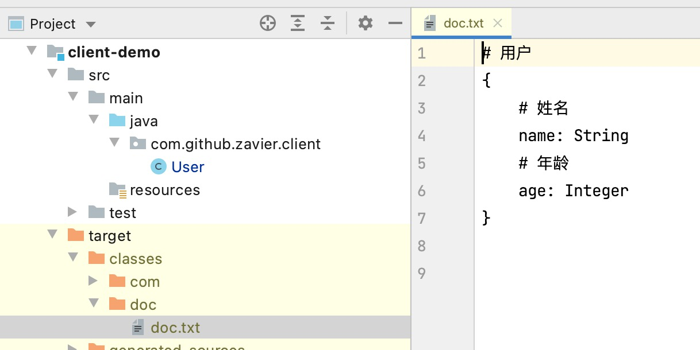

Java注解大家都了解，平时我们使用最多的就是在运行时也有效的注解：`@Retention(RetentionPolicy.RUNTIME)`，可以根据这类注解在运行时进行一些特殊的逻辑处理，如Spring中的AOP使用。但是除了这类在运行时存在的注解，还有两种会保留到源码`@Retention(RetentionPolicy.SOURCE)`和字节码`@Retention(RetentionPolicy.CLASS)`中的注解，这种注解有什么作用呢？

这里介绍一种比较常见的用法-Java注解处理器(Java Annotation Process)，它可以在运行时获取注解信息，生成一些额外的文件信息，如我们常用的`lombok`或`mapstruct`都是使用这种技术

<!-- more -->

下面我们通过一个非常简单的例子来介绍一个它的用法：给前端提供接口时，后端在编写接口文档时，经常会需要将一个类的结构转成json结构并添加注解后提供给前端，这里我们通过注解，在编译时生成类的结构信息

## 定义注解

首先创建一个定义注解的模板，我们定义如下两个注解

```java
// 用于类上面的描述使用
@Target(ElementType.TYPE)
@Retention(RetentionPolicy.CLASS)
public @interface ClassDoc {
    String desc() default "";
}
```

```java
// 用于属性上面的描述使用
@Target(ElementType.FIELD)
@Retention(RetentionPolicy.CLASS)
public @interface FieldDoc {
    String desc() default "";
}
```


## 创建注解处理器

创建用于根据注解生成文档的注解处理器，因为Processor需要SPI方式声明，即在META-INFO/services路径下创建文件（avax.annotation.processing.Processor）并在其中声明对应的实现com.github.zavier.processor.DocProcessor

这里我们使用google的 auto-service来简化声明流程

```xml
<dependency>
    <groupId>com.google.auto.service</groupId>
    <artifactId>auto-service</artifactId>
    <version>1.0</version>
</dependency>
```


```JAVA
// === 这个功能现在比较简陋，主要为了说明注解处理的使用，目前只支持最简单的属性解析，暂不支持集合及嵌套等结构 ===

// 声明需要支持的注解类全名称
@SupportedAnnotationTypes({"com.github.zavier.annotation.ClassDoc"})
// 声明支持的版本
@SupportedSourceVersion(SourceVersion.RELEASE_8)
// 使用 autoService来声明处理器
@AutoService(Processor.class)
public class DocProcessor extends AbstractProcessor {

    private final ConcurrentHashMap<String, List<FieldDocInfo>> typeDocMap = new ConcurrentHashMap<>();

    @Override
    public boolean process(Set<? extends TypeElement> annotations, RoundEnvironment roundEnv) {
        try {
            // 是否是处理最后一轮,最后一轮时才真正生成文档
            if (roundEnv.processingOver()) {
                StringBuilder sb = new StringBuilder();
                typeDocMap.forEach((typeName, docInfoList) -> {
                    sb.append("# ").append(typeName).append("\r\n").append("{\r\n");
                    for (FieldDocInfo fieldDocInfo : docInfoList) {
                        sb.append("    ").append("# ").append(fieldDocInfo.desc).append("\r\n");
                        sb.append("    ").append(fieldDocInfo.name).append(": ").append(fieldDocInfo.type).append("\r\n");
                    }
                    sb.append("}\r\n");
                });

                // 创建文件，并写入结果
                final FileObject resource = processingEnv.getFiler().createResource(StandardLocation.CLASS_OUTPUT, "", "doc/doc.txt");
                try (OutputStream out = resource.openOutputStream()) {
                    BufferedWriter writer = new BufferedWriter(new OutputStreamWriter(out, UTF_8));
                    writer.write(sb.toString());
                    writer.newLine();
                    writer.flush();
                }
            } else {
                // 获取有 ClassDoc 注解的元素
                final Set<? extends Element> elements =
                        roundEnv.getElementsAnnotatedWith(ClassDoc.class)
                                .stream()
                                .filter(TypeElement.class::isInstance)
                                .collect(Collectors.toSet());
                for (Element element : elements) {
                    final String typeElementName = element.getAnnotation(ClassDoc.class).desc();
                    // 获取有ClassDoc注解类内部的元素
                    final List<FieldDocInfo> collect = element.getEnclosedElements()
                            .stream()
                            .filter(VariableElement.class::isInstance)
                            .map(VariableElement.class::cast)
                            .map(ele -> {
                                // 处理其中的属性信息
                                final String name = ele.getSimpleName().toString();
                                final String desc = ele.getAnnotation(FieldDoc.class).desc();
                                final TypeKind kind = ele.asType().getKind();
                                if (kind == TypeKind.DECLARED) {
                                    // 如果属性为类的话，则获取对应类的简单名称
                                    final TypeMirror typeMirror = ele.asType();
                                    final DeclaredType mirror = (DeclaredType) typeMirror;
                                    TypeElement e = (TypeElement) (mirror).asElement();
                                    final Name simpleName = e.getSimpleName();
                                    return new FieldDocInfo(name, desc, simpleName.toString());
                                } else {
                                    return new FieldDocInfo(name, desc, kind.name());
                                }
                            }).collect(Collectors.toList());
                    typeDocMap.put(typeElementName, collect);
                }
            }
        } catch (IOException e) {
            processingEnv.getMessager().printMessage(Diagnostic.Kind.ERROR, e.getMessage());
        }
        return false;
    }

    static class FieldDocInfo {
        private String name;
        private String desc;
        private String type;

        public FieldDocInfo() {
        }

        public FieldDocInfo(String name, String desc, String type) {
            this.name = name;
            this.desc = desc;
            this.type = type;
        }

				// 省略 getter setter方法
    }
}

```


下面来看下使用方式

```java
@ClassDoc(desc = "用户")
public class User {
    @FieldDoc(desc = "姓名")
    private String name;

    @FieldDoc(desc = "年龄")
    private Integer age;

}
```

引入处理器的包，编辑后即可在maven target目录下找到生成的文档文件




完整代码位置：https://github.com/zavier/annotation-processor


## 参考资料

https://www.baeldung.com/java-annotation-processing-builder

https://www.jianshu.com/p/5ca05317286e

