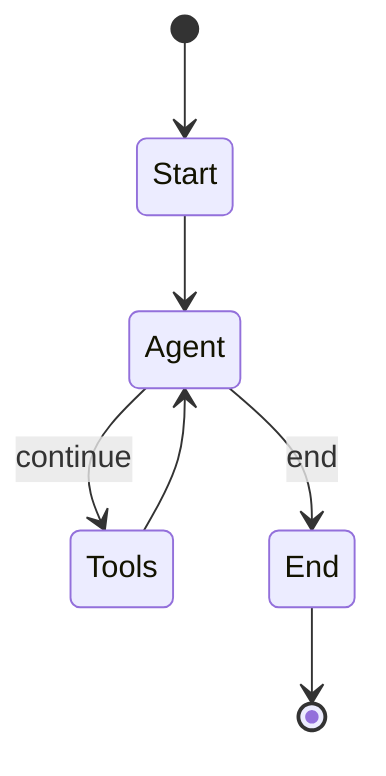
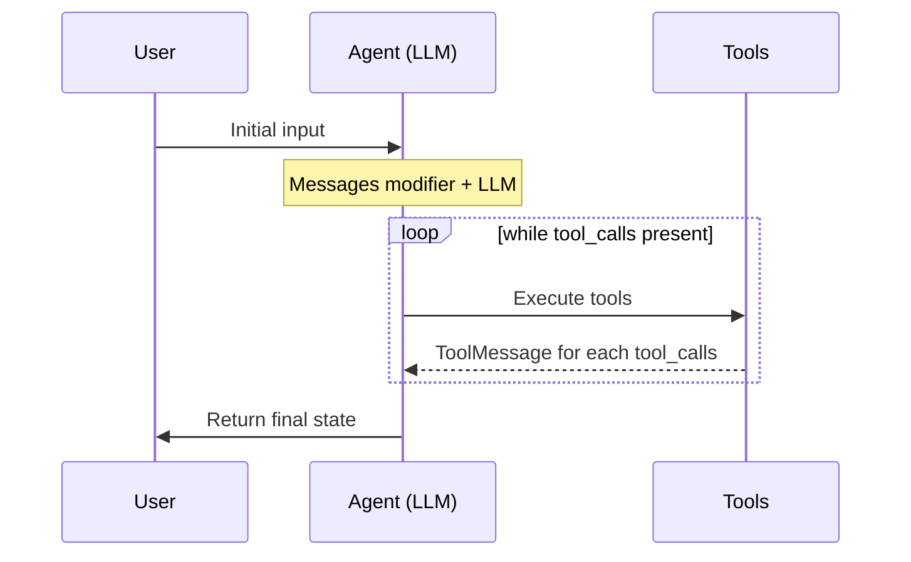

目前agent 大致有两种风格，一种是自己定义相应的工作流程(workflows)，还有一种就是流程完全让大模型自己进行判断处理(agents)

本次主要简单记录一下使用langgraph 及mcp 实现一个 agents

这个可以认为是一个最简化工作流，只有llm 及tools 两个节点，当大模型判断需要调用tools 时就执行调用，直到大模型认为不需要调用工具，这时认为执行结束了，可以返回对应的结果



交互流程




<!-- more -->

首先进行环境创建

```shell
# 创建虚拟环境
> python3 -m venv .venv
# 激活虚拟环境
> source .venv/bin/activate
# 安装依赖（使用deepseek）
> pip install langgraph langchain-deepseek langchain-mcp-adapters
```


具体实现代码

```python
import os
from langchain_deepseek import ChatDeepSeek
from langchain_mcp_adapters.client import MultiServerMCPClient
from langgraph.prebuilt import create_react_agent
import asyncio

# 设置deepseek的key
os.environ["DEEPSEEK_API_KEY"] = "设置自己的deepseek的apikey"

# 构造llm
model = ChatDeepSeek(
    model="deepseek-chat",
    temperature=0,
    max_tokens=1000,
    max_retries=2
)

async def run():
    # 定义需要使用的 mcp client
    async with MultiServerMCPClient({
        # 高德地图
        "amap-maps": {
            "timeout": 60,
            "command": "npx",
            "args": [
                "-y",
                "@amap/amap-maps-mcp-server"
            ],
            "env": {
                # 这里需要替换成自己申请的key
                "AMAP_MAPS_API_KEY": "<高德地图key>"
            },
            "transport": "stdio"
        },
        # 本次文件mcp, 可以读取操作文件
        "filesystem": {
            "command": "npx",
            "args": [
                "-y",
                "@modelcontextprotocol/server-filesystem",
                # 这里提供的是允许写入的路径
                "/Users/zhengwei/mcp-dir"
            ]
        }
    }
    ) as client:
        # 构造一个agent, 提供llm及tools
        agent = create_react_agent(model, client.get_tools(), debug=True)
        # 实际调用获取结果
        resp = await agent.ainvoke({"messages": "北京有什么好玩的景点？帮我生成一个两天的旅游计划，结果写入到文件【北京旅游.md】中，文件没有需要新建"})
        print(resp["messages"][-1].content)

if __name__ == '__main__':
    asyncio.run(run())
```

对应的执行结果大致如下：

```
{'messages': [HumanMessage(content='北京有什么好玩的景点？帮我生成一个两天的旅游计划，结果写入到文件【北京旅游.md】中，文件没有需要新建', additional_kwargs={}, response_metadata={}, id='99bf1947-bae9-4dfa-a051-381179b98ab2'),
              AIMessage(content='', additional_kwargs={'tool_calls': [{'id': 'call_0_be4e6e41-f746-48ab-bd32-70e3dac3e584', 'function': {'arguments': '{"keywords": "北京景点", "city": "北京"}', 'name': 'maps_text_search'}, 'type': 'function', 'index': 0}], 'refusal': None}, response_metadata={'token_usage': {'completion_tokens': 27, 'prompt_tokens': 3673, 'total_tokens': 3700, 'completion_tokens_details': None, 'prompt_tokens_details': {'audio_tokens': None, 'cached_tokens': 3648}, 'prompt_cache_hit_tokens': 3648, 'prompt_cache_miss_tokens': 25}, 'model_name': 'deepseek-chat', 'system_fingerprint': 'fp_8802369eaa_prod0225', 'id': '4c7ff234-f18d-4a5e-b873-899cf574f6db', 'finish_reason': 'tool_calls', 'logprobs': None}, id='run-08319f61-6e47-44dd-8b29-7d90367ff192-0', tool_calls=[{'name': 'maps_text_search', 'args': {'keywords': '北京景点', 'city': '北京'}, 'id': 'call_0_be4e6e41-f746-48ab-bd32-70e3dac3e584', 'type': 'tool_call'}], usage_metadata={'input_tokens': 3673, 'output_tokens': 27, 'total_tokens': 3700, 'input_token_details': {'cache_read': 3648}, 'output_token_details': {}}),
              ToolMessage(content='{\n  "suggestion": {\n    "keywords": [],\n    "ciytes": []\n  },\n  "pois": [\n    {\n      "id": "B000A7K91S",\n      "name": "北京凤凰岭景区",\n      "address": "苏家坨镇凤凰岭路19号",\n      "typecode": "110202",\n      "photos": {\n        "provider": [],\n        "title": "春季",\n        "url": "http://store.is.autonavi.com/showpic/23702a2af1314e1388caedb91306545d"\n      }\n    },\n    {\n      "id": "B0GR0NV5SW",\n      "name": "北京凤凰岭景区-北线景区",\n      "address": "苏家坨镇凤凰岭路19号北京凤凰岭自然风景区公园内",\n      "typecode": "110000",\n      "photos": {\n        "provider": [],\n        "title": [],\n        "url": "https://aos-comment.amap.com/B0GR0NV5SW/comment/67c4e12256f65243739db283ab97a474_2048_2048_80.jpg"\n      }\n    },\n    {\n      "id": "B000A83C1S",\n      "name": "天安门广场",\n      "address": "东长安街",\n      "typecode": "110210|110105",\n      "photos": {\n        "provider": [],\n        "title": [],\n        "url": "http://aos-cdn-image.amap.com/sns/ugccomment/fab72424-5643-4c14-9486-ae1c8475eab7.jpg"\n      }\n    },\n    {\n      "id": "B000A60DA1",\n      "name": "天安门",\n      "address": "长安街北侧",\n      "typecode": "110202",\n      "photos": {\n        "provider": [],\n        "title": "天安门",\n        "url": "http://store.is.autonavi.com/showpic/17a36a737908810a310387c7d53e878a"\n      }\n    },\n    {\n      "id": "B000A8UIN8",\n      "name": "故宫博物院",\n      "address": "景山前街4号",\n      "typecode": "110201|140100",\n      "photos": {\n        "provider": [],\n        "title": [],\n        "url": "http://store.is.autonavi.com/showpic/ae0a73885ccb64f09b73adef515c8c28"\n      }\n    },\n    {\n      "id": "B000A8UR3U",\n      "name": "前门大街",\n      "address": "东城区",\n      "typecode": "190000",\n      "photos": {\n        "title": [],\n        "url": "http://store.is.autonavi.com/showpic/34231e4fb695d9aebac2a72575212a97"\n      }\n    },\n    {\n      "id": "B000A83U0P",\n      "name": "中国国家博物馆",\n      "address": "东长安街16号天安门广场东侧",\n      "typecode": "140100",\n      "photos": {\n        "title": [],\n        "url": "https://aos-comment.amap.com/B000A83U0P/headerImg/c18b1708f9b307ca92bf78809f7a0220_2048_2048_80.jpg"\n      }\n    },\n    {\n      "id": "B000A81CB2",\n      "name": "天坛公园",\n      "address": "天坛东里甲1号",\n      "typecode": "110101",\n      "photos": {\n        "provider": [],\n        "title": [],\n        "url": "http://store.is.autonavi.com/showpic/1d61cb916219f225ab07e012952f9220"\n      }\n    },\n    {\n      "id": "B0FFG8YDKK",\n      "name": "天安门-城楼",\n      "address": "东长安街天安门(天安门东地铁站A西北入口步行290米)",\n      "typecode": "110202",\n      "photos": {\n        "provider": [],\n        "title": [],\n        "url": "https://aos-comment.amap.com/B0FFG8YDKK/comment/content_media_external_images_media_705272_ss__1733778483467_94791834.jpg"\n      }\n    },\n    {\n      "id": "B000A7I1OL",\n      "name": "景山公园",\n      "address": "景山西街44号",\n      "typecode": "110101",\n      "photos": {\n        "provider": [],\n        "title": "春季",\n        "url": "http://store.is.autonavi.com/showpic/10eb01af2fd301e54e50d42ea636ccef"\n      }\n    },\n    {\n      "id": "B000A48169",\n      "name": "王府井步行街",\n      "address": "王府井大街256号(金鱼胡同地铁站B东口步行80米)",\n      "typecode": "061001",\n      "photos": {\n        "title": [],\n        "url": "http://store.is.autonavi.com/showpic/c5d1f954b76563325f7a9d7433b66167"\n      }\n    },\n    {\n      "id": "B000A7I99C",\n      "name": "毛主席纪念堂",\n      "address": "前门东大街11号(天安门广场人民英雄纪念碑南面)",\n      "typecode": "110204",\n      "photos": {\n        "provider": [],\n        "title": [],\n        "url": "http://store.is.autonavi.com/showpic/67f80db8806f358b501c3ca920fede2d"\n      }\n    },\n    {\n      "id": "B000A840SB",\n      "name": "中山公园",\n      "address": "中华路4号(天安门西侧)",\n      "typecode": "110101",\n      "photos": {\n        "provider": [],\n        "title": [],\n        "url": "http://store.is.autonavi.com/showpic/4d1216ff3ef92137912db31aaacd3c5f"\n      }\n    },\n    {\n      "id": "B0FFFRLTUT",\n      "name": "天安门广场-国旗",\n      "address": "景山前街4号天安门广场内(北侧)",\n      "typecode": "110200",\n      "photos": {\n        "provider": [],\n        "title": "997",\n        "url": "http://store.is.autonavi.com/showpic/b2e84bbc07d56d5dc5e843a93a03061d"\n      }\n    },\n    {\n      "id": "B000A84GDN",\n      "name": "故宫博物院-午门",\n      "address": "东华门街道景山前街4号故宫博物院内(南侧)",\n      "typecode": "110200",\n      "photos": {\n        "provider": [],\n        "title": [],\n        "url": "http://store.is.autonavi.com/showpic/dcd78b35cb123744056c03072ecdea17"\n      }\n    },\n    {\n      "id": "B000A80UL1",\n      "name": "北海公园",\n      "address": "文津街1号",\n      "typecode": "110101",\n      "photos": {\n        "provider": [],\n        "title": [],\n        "url": "http://store.is.autonavi.com/showpic/68a92863a790f69d2221f7c53906c8c2"\n      }\n    },\n    {\n      "id": "B000A84KJP",\n      "name": "北京大栅栏",\n      "address": "煤市街",\n      "typecode": "061000",\n      "photos": {\n        "title": [],\n        "url": "http://store.is.autonavi.com/showpic/06516b3c3623785561df5b64bd90331d"\n      }\n    },\n    {\n      "id": "B0FFFAH7I9",\n      "name": "南锣鼓巷",\n      "address": "交道口街道南大街(南锣鼓巷地铁站E西北口旁)",\n      "typecode": "110200",\n      "photos": {\n        "provider": [],\n        "title": [],\n        "url": "http://store.is.autonavi.com/showpic/6aa94c24640267a56c22af0b9629030a"\n      }\n    },\n    {\n      "id": "B0FFGZ003Z",\n      "name": "北京前门大栅栏",\n      "address": "大栅栏西街110号大栅栏西街商业",\n      "typecode": "110000",\n      "photos": {\n        "provider": [],\n        "title": [],\n        "url": "https://aos-comment.amap.com/B0FFGZ003Z/comment/CA41730C_ADDF_4545_ABCD_841E295320D8_L0_001_1234_1645_1742039826377_15657038.jpg"\n      }\n    },\n    {\n      "id": "B000A7QHTR",\n      "name": "太庙",\n      "address": "东华门街道东长安街北京市劳动人民文化宫",\n      "typecode": "110205",\n      "photos": {\n        "provider": [],\n        "title": [],\n        "url": "http://store.is.autonavi.com/showpic/3029a20076593ba33b5ebbdcfea7e569"\n      }\n    }\n  ]\n}', name='maps_text_search', id='4387ae3d-b9e1-4c9e-9d27-d95af1854437', tool_call_id='call_0_be4e6e41-f746-48ab-bd32-70e3dac3e584'),
              AIMessage(content='', additional_kwargs={'tool_calls': [{'id': 'call_0_bcbd50ae-aece-4de9-bae4-d73ae0bf698f', 'function': {'arguments': '{"path":"北京旅游.md","content":"# 北京两日旅游计划\\n\\n## 第一天\\n\\n### 上午\\n1. **天安门广场**\\n   - 地址：东长安街\\n   - 简介：中国最大的城市广场，是北京的地标之一。\\n\\n2. **天安门**\\n   - 地址：长安街北侧\\n   - 简介：中国的象征性建筑，可以登上城楼俯瞰广场。\\n\\n3. **故宫博物院**\\n   - 地址：景山前街4号\\n   - 简介：世界上现存规模最大、保存最完整的木质结构古建筑群。\\n\\n### 下午\\n4. **景山公园**\\n   - 地址：景山西街44号\\n   - 简介：登上万春亭可以俯瞰整个故宫全景。\\n\\n5. **北海公园**\\n   - 地址：文津街1号\\n   - 简介：中国现存最古老、最完整的皇家园林之一。\\n\\n### 晚上\\n6. **王府井步行街**\\n   - 地址：王府井大街256号\\n   - 简介：北京著名的商业街，适合购物和品尝美食。\\n\\n## 第二天\\n\\n### 上午\\n1. **天坛公园**\\n   - 地址：天坛东里甲1号\\n   - 简介：明清两代皇帝祭天祈谷的场所。\\n\\n2. **前门大街**\\n   - 地址：东城区\\n   - 简介：北京著名的商业街，保留了许多老字号店铺。\\n\\n### 下午\\n3. **南锣鼓巷**\\n   - 地址：交道口街道南大街\\n   - 简介：北京最具特色的胡同之一，充满文艺气息。\\n\\n4. **北京大栅栏**\\n   - 地址：煤市街\\n   - 简介：历史悠久的老商业区，适合体验老北京风情。\\n\\n### 晚上\\n5. **中国国家博物馆**\\n   - 地址：东长安街16号天安门广场东侧\\n   - 简介：了解中国历史文化的重要场所。\\n\\n希望这份计划能帮助您更好地游览北京！"}', 'name': 'write_file'}, 'type': 'function', 'index': 0}], 'refusal': None}, response_metadata={'token_usage': {'completion_tokens': 502, 'prompt_tokens': 5912, 'total_tokens': 6414, 'completion_tokens_details': None, 'prompt_tokens_details': {'audio_tokens': None, 'cached_tokens': 5888}, 'prompt_cache_hit_tokens': 5888, 'prompt_cache_miss_tokens': 24}, 'model_name': 'deepseek-chat', 'system_fingerprint': 'fp_8802369eaa_prod0225', 'id': 'b81a5c9c-1201-4684-8053-b27bd8f5e26e', 'finish_reason': 'tool_calls', 'logprobs': None}, id='run-488323c9-2396-4a91-ab62-6c830cde7947-0', tool_calls=[{'name': 'write_file', 'args': {'path': '北京旅游.md', 'content': '# 北京两日旅游计划\n\n## 第一天\n\n### 上午\n1. **天安门广场**\n   - 地址：东长安街\n   - 简介：中国最大的城市广场，是北京的地标之一。\n\n2. **天安门**\n   - 地址：长安街北侧\n   - 简介：中国的象征性建筑，可以登上城楼俯瞰广场。\n\n3. **故宫博物院**\n   - 地址：景山前街4号\n   - 简介：世界上现存规模最大、保存最完整的木质结构古建筑群。\n\n### 下午\n4. **景山公园**\n   - 地址：景山西街44号\n   - 简介：登上万春亭可以俯瞰整个故宫全景。\n\n5. **北海公园**\n   - 地址：文津街1号\n   - 简介：中国现存最古老、最完整的皇家园林之一。\n\n### 晚上\n6. **王府井步行街**\n   - 地址：王府井大街256号\n   - 简介：北京著名的商业街，适合购物和品尝美食。\n\n## 第二天\n\n### 上午\n1. **天坛公园**\n   - 地址：天坛东里甲1号\n   - 简介：明清两代皇帝祭天祈谷的场所。\n\n2. **前门大街**\n   - 地址：东城区\n   - 简介：北京著名的商业街，保留了许多老字号店铺。\n\n### 下午\n3. **南锣鼓巷**\n   - 地址：交道口街道南大街\n   - 简介：北京最具特色的胡同之一，充满文艺气息。\n\n4. **北京大栅栏**\n   - 地址：煤市街\n   - 简介：历史悠久的老商业区，适合体验老北京风情。\n\n### 晚上\n5. **中国国家博物馆**\n   - 地址：东长安街16号天安门广场东侧\n   - 简介：了解中国历史文化的重要场所。\n\n希望这份计划能帮助您更好地游览北京！'}, 'id': 'call_0_bcbd50ae-aece-4de9-bae4-d73ae0bf698f', 'type': 'tool_call'}], usage_metadata={'input_tokens': 5912, 'output_tokens': 502, 'total_tokens': 6414, 'input_token_details': {'cache_read': 5888}, 'output_token_details': {}}),
              ToolMessage(content="Error: ToolException('Error: Access denied - path outside allowed directories: /Users/zhengwei/code/python/langchain-study/北京旅游.md not in /Users/zhengwei/mcp-dir')\n Please fix your mistakes.", name='write_file', id='84ab83c3-45a5-4b73-b758-19fdc02ec8b0', tool_call_id='call_0_bcbd50ae-aece-4de9-bae4-d73ae0bf698f', status='error'),
              AIMessage(content='', additional_kwargs={'tool_calls': [{'id': 'call_0_7a45e1ee-9fab-49ee-9ee4-9c2681930607', 'function': {'arguments': '{}', 'name': 'list_allowed_directories'}, 'type': 'function', 'index': 0}], 'refusal': None}, response_metadata={'token_usage': {'completion_tokens': 18, 'prompt_tokens': 7734, 'total_tokens': 7752, 'completion_tokens_details': None, 'prompt_tokens_details': {'audio_tokens': None, 'cached_tokens': 6080}, 'prompt_cache_hit_tokens': 6080, 'prompt_cache_miss_tokens': 1654}, 'model_name': 'deepseek-chat', 'system_fingerprint': 'fp_8802369eaa_prod0225', 'id': '3c232acf-39fe-41e0-81bc-b6575f84b0ee', 'finish_reason': 'tool_calls', 'logprobs': None}, id='run-8025dde7-f50a-464e-86b5-e349a4476107-0', tool_calls=[{'name': 'list_allowed_directories', 'args': {}, 'id': 'call_0_7a45e1ee-9fab-49ee-9ee4-9c2681930607', 'type': 'tool_call'}], usage_metadata={'input_tokens': 7734, 'output_tokens': 18, 'total_tokens': 7752, 'input_token_details': {'cache_read': 6080}, 'output_token_details': {}}),
              ToolMessage(content='Allowed directories:\n/Users/zhengwei/mcp-dir', name='list_allowed_directories', id='192721cc-8f29-4aa2-862b-ef1d9d8e906a', tool_call_id='call_0_7a45e1ee-9fab-49ee-9ee4-9c2681930607'),
              AIMessage(content='', additional_kwargs={'tool_calls': [{'id': 'call_0_c4875e0e-8ad7-4d04-aa4a-bdeccbada0f6', 'function': {'arguments': '{"path":"/Users/zhengwei/mcp-dir/北京旅游.md","content":"# 北京两日旅游计划\\n\\n## 第一天\\n\\n### 上午\\n1. **天安门广场**\\n   - 地址：东长安街\\n   - 简介：中国最大的城市广场，是北京的地标之一。\\n\\n2. **天安门**\\n   - 地址：长安街北侧\\n   - 简介：中国的象征性建筑，可以登上城楼俯瞰广场。\\n\\n3. **故宫博物院**\\n   - 地址：景山前街4号\\n   - 简介：世界上现存规模最大、保存最完整的木质结构古建筑群。\\n\\n### 下午\\n4. **景山公园**\\n   - 地址：景山西街44号\\n   - 简介：登上万春亭可以俯瞰整个故宫全景。\\n\\n5. **北海公园**\\n   - 地址：文津街1号\\n   - 简介：中国现存最古老、最完整的皇家园林之一。\\n\\n### 晚上\\n6. **王府井步行街**\\n   - 地址：王府井大街256号\\n   - 简介：北京著名的商业街，适合购物和品尝美食。\\n\\n## 第二天\\n\\n### 上午\\n1. **天坛公园**\\n   - 地址：天坛东里甲1号\\n   - 简介：明清两代皇帝祭天祈谷的场所。\\n\\n2. **前门大街**\\n   - 地址：东城区\\n   - 简介：北京著名的商业街，保留了许多老字号店铺。\\n\\n### 下午\\n3. **南锣鼓巷**\\n   - 地址：交道口街道南大街\\n   - 简介：北京最具特色的胡同之一，充满文艺气息。\\n\\n4. **北京大栅栏**\\n   - 地址：煤市街\\n   - 简介：历史悠久的老商业区，适合体验老北京风情。\\n\\n### 晚上\\n5. **中国国家博物馆**\\n   - 地址：东长安街16号天安门广场东侧\\n   - 简介：了解中国历史文化的重要场所。\\n\\n希望这份计划能帮助您更好地游览北京！"}', 'name': 'write_file'}, 'type': 'function', 'index': 0}], 'refusal': None}, response_metadata={'token_usage': {'completion_tokens': 512, 'prompt_tokens': 7769, 'total_tokens': 8281, 'completion_tokens_details': None, 'prompt_tokens_details': {'audio_tokens': None, 'cached_tokens': 7744}, 'prompt_cache_hit_tokens': 7744, 'prompt_cache_miss_tokens': 25}, 'model_name': 'deepseek-chat', 'system_fingerprint': 'fp_8802369eaa_prod0225', 'id': 'fbb6776a-92be-44bd-8d00-6780e2028cf2', 'finish_reason': 'tool_calls', 'logprobs': None}, id='run-010b6ce4-b03a-4185-8601-d2e9bb19c1f0-0', tool_calls=[{'name': 'write_file', 'args': {'path': '/Users/zhengwei/mcp-dir/北京旅游.md', 'content': '# 北京两日旅游计划\n\n## 第一天\n\n### 上午\n1. **天安门广场**\n   - 地址：东长安街\n   - 简介：中国最大的城市广场，是北京的地标之一。\n\n2. **天安门**\n   - 地址：长安街北侧\n   - 简介：中国的象征性建筑，可以登上城楼俯瞰广场。\n\n3. **故宫博物院**\n   - 地址：景山前街4号\n   - 简介：世界上现存规模最大、保存最完整的木质结构古建筑群。\n\n### 下午\n4. **景山公园**\n   - 地址：景山西街44号\n   - 简介：登上万春亭可以俯瞰整个故宫全景。\n\n5. **北海公园**\n   - 地址：文津街1号\n   - 简介：中国现存最古老、最完整的皇家园林之一。\n\n### 晚上\n6. **王府井步行街**\n   - 地址：王府井大街256号\n   - 简介：北京著名的商业街，适合购物和品尝美食。\n\n## 第二天\n\n### 上午\n1. **天坛公园**\n   - 地址：天坛东里甲1号\n   - 简介：明清两代皇帝祭天祈谷的场所。\n\n2. **前门大街**\n   - 地址：东城区\n   - 简介：北京著名的商业街，保留了许多老字号店铺。\n\n### 下午\n3. **南锣鼓巷**\n   - 地址：交道口街道南大街\n   - 简介：北京最具特色的胡同之一，充满文艺气息。\n\n4. **北京大栅栏**\n   - 地址：煤市街\n   - 简介：历史悠久的老商业区，适合体验老北京风情。\n\n### 晚上\n5. **中国国家博物馆**\n   - 地址：东长安街16号天安门广场东侧\n   - 简介：了解中国历史文化的重要场所。\n\n希望这份计划能帮助您更好地游览北京！'}, 'id': 'call_0_c4875e0e-8ad7-4d04-aa4a-bdeccbada0f6', 'type': 'tool_call'}], usage_metadata={'input_tokens': 7769, 'output_tokens': 512, 'total_tokens': 8281, 'input_token_details': {'cache_read': 7744}, 'output_token_details': {}}),
              ToolMessage(content='Successfully wrote to /Users/zhengwei/mcp-dir/北京旅游.md', name='write_file', id='b398d1a1-23f2-4eb0-8787-36180450b0b9', tool_call_id='call_0_c4875e0e-8ad7-4d04-aa4a-bdeccbada0f6'),
              AIMessage(content='我已成功将北京两日旅游计划写入文件 `/Users/zhengwei/mcp-dir/北京旅游.md`。以下是文件内容的简要概述：\n\n### 第一天\n- **上午**：天安门广场、天安门、故宫博物院\n- **下午**：景山公园、北海公园\n- **晚上**：王府井步行街\n\n### 第二天\n- **上午**：天坛公园、前门大街\n- **下午**：南锣鼓巷、北京大栅栏\n- **晚上**：中国国家博物馆\n\n希望这份计划能帮助您更好地游览北京！如果需要进一步调整或补充，请随时告诉我。', additional_kwargs={'refusal': None}, response_metadata={'token_usage': {'completion_tokens': 133, 'prompt_tokens': 9570, 'total_tokens': 9703, 'completion_tokens_details': None, 'prompt_tokens_details': {'audio_tokens': None, 'cached_tokens': 7744}, 'prompt_cache_hit_tokens': 7744, 'prompt_cache_miss_tokens': 1826}, 'model_name': 'deepseek-chat', 'system_fingerprint': 'fp_8802369eaa_prod0225', 'id': '24b806b5-9ad1-4c71-b4b6-9aa07b2ecee9', 'finish_reason': 'stop', 'logprobs': None}, id='run-683bc035-1997-4a30-9080-788b3c194a6e-0', usage_metadata={'input_tokens': 9570, 'output_tokens': 133, 'total_tokens': 9703, 'input_token_details': {'cache_read': 7744}, 'output_token_details': {}})]}
我已成功将北京两日旅游计划写入文件 `/Users/zhengwei/mcp-dir/北京旅游.md`。以下是文件内容的简要概述：
```

通过日志可以看出来执行步骤：

1. 将问题发送给大模型
2. 大模型判断需要调用高德地图的`maps_text_search`工具来搜索北京的景点
3. 高德地图工具执行，获取到北京景点信息
4. 大模型判断需要调用filesystem 的`write_file`来写入结果文件
5. 工具执行失败，提示没有写入文件的权限
6. 大模型判断需要调用`list_allowed_directories`工具来获取允许的文件路径信息
7. 执行工具，获取到了允许操作的路径
8. 大模型判断再次调用`write_file`工具来写入文件，同时已经根据允许的路径替换了写入位置
9. 写入文件工具执行成功


参考资料：

https://langchain-ai.github.io/langgraph/concepts/high_level/

https://www.anthropic.com/engineering/building-effective-agents

https://cdn.openai.com/business-guides-and-resources/a-practical-guide-to-building-agents.pdf

https://archive.org/details/google-ai-agents-whitepaper
