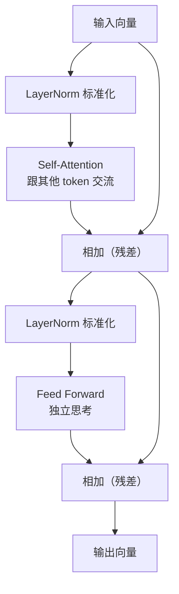

作为应用层开发者，这些概念我们每天都在用——Agent、RAG、Context Engineering、模型调用。但模型内部到底在做什么，一直处于一个「大概知道、细节模糊」的状态。

比如这些现象，我遇到过但解释不清楚：

- 为什么长上下文贵？
- 为什么 prompt 越长响应越慢？
- 为什么 RAG 需要控制 context？
- 为什么流式输出不是「假装」的？

这些问题都指向同一件事：**推理阶段。** 理解推理不需要先学会训练，也不需要成为算法工程师。只要从「一段文字进入模型到输出一个 token」这个完整链路走一遍，上面那些问题自然就有答案了。

这篇文章就是我走完这条路之后的笔记。它试图用后端开发能理解的方式来翻译 Transformer 内部的机制。

<!-- more -->

---

# 1. 当一次 API 调用发生时

先建立最核心的一张图。假设你调用 API，输入：**"今天天气"**

收到：**"很好"**

模型内部发生了什么：

```
文字 "今天天气"
  ↓  Tokenizer —— 把文字切成 token，每个 token 查词表得到一个数字
[1234, 5678, 9012]
  ↓  Embedding —— 数字查表，变成高维向量
[[v₁], [v₂], [v₃]]                    ← 三个 4096 维的浮点数数组
  ↓  Transformer × 32 —— 每一层加工向量，逐步建立上下文理解
最后一个位置的向量                     ← "气"经过 32 层加工后的表示
  ↓  Linear —— 把向量映射到词表大小
128000 个数字                          ← 每个数字对应一个候选字的"原始分数"
  ↓  Softmax —— 把分数转成概率
128000 个概率                          ← 加起来等于 1
  ↓  Sampling —— 按概率选一个字
"很"                                   ← 第一个输出
  ↓  把 "很" 拼回输入，再来一遍
"好" → ... → <EOS>（结束信号）          ← 逐 token 生成，直到结束
```

三个立刻要建立的认知。

**第一，模型一次只生成一个 token。** 你看到的一段话，是模型跑了 N 次循环，每次产出一个 token 拼起来的。生成速度的"tokens/秒"就是这个意思——每秒能在循环里跑几轮。

**第二，模型眼睛里只有数字。** 你以为它读的是"今天天气"，它实际看到的是 `[1234, 5678, 9012]`。同理它输出的不是"很"这个汉字，而是一个数字，这个数字在词表里恰好对应"很"。序列化/反序列化的过程。

**第三，向量是模型的唯一语言。** Token 变成向量之后，所有的计算都是矩阵乘法——没有一步是"操作文字"的。Transformer 的每一层吃向量、吐向量。就像你的业务对象经 ORM 变成 SQL，进了数据库变成 B+Tree 上的字节——每一层有自己的表示形式。

---

## Prefill 与 Decode：推理的两个阶段

上面那个循环实际上被切割成两个完全不同的阶段。

| | Prefill（预填充） | Decode（自回归生成） |
|---|---|---|
| **做什么** | 一次性处理所有输入 token | 逐个生成输出 token |
| **参与范围** | 全部输入 token | 全部历史 token + 新生成的 1 个 |
| **计算方式** | 所有 token 并行算 Attention | 新 token 用历史的 K/V 缓存 |
| **瓶颈** | GPU 算力（compute-bound） | 显存带宽（memory-bound） |
| **类比** | 全表扫描的聚合查询 | 100 次 `SELECT WHERE id=?`，一次一行 |

时间线是这样的：

```
用户发送 "今天天气"
  │
  ├─ Prefill ──────────────────────┐
  │  3 个 token 同时进，GPU 跑满     │  耗时 ≈ 10ms
  │  产出 "很"                      │
  └────────────────────────────────┘
  │
  ├─ Decode step 1 ────────────────┐
  │  只算 "很" 一个 token            │  耗时 ≈ 5ms
  │  但要读全部历史的 K/V 缓存         │  （大部分时间在等显存传数据）
  │  产出 "好"                      │
  └────────────────────────────────┘
  │
  ├─ Decode step 2 ────────────────┐
  │  同上，产出 <EOS>                │
  └────────────────────────────────┘
```

Prefill 是一次性并行计算，GPU 的所有计算单元都在忙。Decode 每次只算 1 个 token，矩阵乘法的规模很小，GPU 的大部分算力在空转——但每次都要从显存搬运全部历史的 K/V 缓存。**Decode 慢不是因为算得慢，是因为读得多。**

这直接解释了你的几个实际问题：

- **长输入比长输出便宜。** 输入 token 在 Prefill 阶段并行处理，输出 token 在 Decode 阶段串行处理。API 按 token 计费时输出通常比输入贵 2-5 倍。
- **TTFT（首 token 延迟）受 Prefill 影响。** prompt 越长，第一个字出来越慢。
- **生成速度（tokens/s）受 Decode 影响。** 每个字之间的间隔，取决于显存带宽。
- **流式输出不是"假装"的。** Decode 本身就是一次一个 token 地出的，`stream=True` 就是不攒，出一个推一个。非流式才是"攒起来一次性返回"。

---

# 2. Tokenizer：模型为什么不识汉字

## BPE：高频合并，低频分开

模型能处理的不是文字，是数字。Tokenizer 就是做"文字 ↔ 数字"映射的组件。

最朴素的方案：给每个汉字单独编号。"我"=1、"喜"=2、"欢"=3...但问题很明显——"智能"作为一个词整体出现时，它的语义和"智"+"能"的简单拼凑不同。模型应该直接认识"智能"这个词。

反过来，如果给所有常见词汇都独立编号，词表直接爆炸。中文双字词几万个，三字词、成语、专有名词加上去，几十万起步。词表越大，最后一层 Linear 的计算量越大（要从十几万候选中选一个），而且低频词在训练数据里出现次数太少，学不到有意义的表示。

**BPE（Byte Pair Encoding，字节对编码）** 把矛盾拆成了合并策略：

> 如果两个字符频繁一起出现，就合并成一个新的 token。

假设训练语料里"人工""智能"频繁挨在一起，BPE 会统计所有相邻字符对的频率。合并"人"+"工"成一个 token，合并"智"+"能"成一个 token。继续迭代，如果"人工"+"智能"又频繁一起出现，再合并成"人工智能"。

什么时候停？**词表达到预设大小就停。** Llama 3 的上限是 128000。

结果就是：**高频组合被合并成单个 token，低频词保持被拆分的状态。** "人工智能"可能是一个 token，"司马懿"大概率还是三个。

## 每个模型有自己的词表

词表是训练前用 BPE 在海量语料上跑出来的。训练过程中词表不变，推理也只用同一份。不同的训练语料 → 不同的合并结果 → 不同的词表。

| 模型 | 词表大小 |
|---|---|
| GPT-4o | ~100,000 |
| Llama 3（全系列）| 128,000 |
| Qwen 2 | ~152,000 |
| DeepSeek V3 | ~129,000 |

## 中文为什么比英文更费 token

英文有天然的空格分隔，BPE 在英文上的合并效率极高。"artificial intelligence" 可能就 2 个 token。中文是连续书写的，BPE 必须自己推断词边界。**相同的语义信息，中文消耗的 token 数约为英文的 1.5-2 倍（具体比例因模型分词器而异）。**

这对你有三个直接影响：

1. **API 成本。** 同样语义的中文 prompt 比英文 prompt token 更多 → 更贵。
2. **上下文窗口利用率。** 128K token 窗口，中文内容填满的速度比英文快得多。你的一篇 10 万字中文文档可能 12 万 token 就出去了。
3. **RAG 分块策略。** 分块时不能按字数算，要按 token 数算。否则你以为每个 chunk 一样大，实际上差异很大。

## 特殊 Token

词表里还有不表示文字、但控制模型行为的特殊 token：

| 特殊 Token | 作用 |
|---|---|
| `<BOS>` / `<s>` | 序列开始，告诉模型"这是一条新输入" |
| `<EOS>` / `</s>` | 序列结束。模型输出这个就停，没输出它就一直生成到你设置的 `max_tokens` |
| `<PAD>` | 填充符，batch 推理时把长度不同的句子对齐 |

Chat 模型还有更多：`<|user|>`、`<|assistant|>`、`<|eot_id|>`（end of turn）——帮模型分辨谁在说话、一轮对话在哪结束。你调 API 时看不到它们，是 SDK 帮你塞进去的。

> **Tokenizer = LLM 的序列化协议。** 你有 Protobuf/JSON，模型有 BPE Tokenizer。每个模型有自己的映射表，训练前定好，推理时只读不改。

---

# 3. Embedding：每个字都有一张"名片"

现在你的输入"今天天气"变成了 `[1234, 5678, 9012]`，三个 token ID。数字本身不包含语义——`1234 < 5678` 跟"今"和"天"的语义没有半毛钱关系。

## 查表，不是计算

Embedding 做的事简单到你可能不信：

```
token ID 1234 → 去第 1234 行取一行向量 → 返回
```

这本质上是一张巨大的查找表——**Embedding Matrix（嵌入矩阵）**：

```
         ┌──────┬──────────────────────────────────┐
token ID │      │            向量 (4096维)          │
         ├──────┼──────────────────────────────────┤
   0     │      │ [0.02, -0.11,  0.34, ...,  0.05] │
   1     │      │ [0.78,  0.23, -0.56, ..., -0.12] │
  ...    │      │              ...                 │
  1234   │      │ [0.23,  0.56, -0.12, ...,  0.78] │ ← "今"
  ...    │      │              ...                 │
 128000  │      │ [0.01, -0.03,  0.55, ...,  0.18] │
         └──────┴──────────────────────────────────┘
```

没有计算，就是行索引 + 取行。矩阵的大小是 `词表大小 × 向量维度`，Llama 3 8B 就是 `128000 × 4096`。

## 为什么是 4096 维？

不同模型的维度不同——Llama 3 8B 是 4096 维，70B 版本是 8192 维，原理是一样的。三维只能描述三个属性（`[身高, 体重, 年龄]`）。但一个词的含义需要同时编码词性、语义类别、情感倾向、和其他词的关系、语境用法……几百到几千个维度才能给每个词足够的"空间"去承载这些信息。

每一维的具体含义不是人为定义的——是模型在训练过程中自己学出来的。你只需要知道，**维度越多，能编码的语义信息越丰富。**

## 语义相近的向量也相近

Embedding 最核心的性质：

```
"国王" 的向量靠近 "王后" 的向量，远离 "苹果" 的向量
```

想象三维空间的简化版："国王"和"王后"的位置聚在一起，"苹果"和"香蕉"聚在另一个区域。实际是 4096 维空间，原理一样。计算两个向量的余弦相似度（cosine similarity）——值越接近 1，两个词的语义越近。

## 跟 RAG 的关系

你在做 RAG 时，检索步骤本质上就是：

```
用户问题 → Embedding → 一个 4096 维向量
    ↓
去向量数据库做 KNN 搜索（找最接近的 top-K 个文档向量）
    ↓
相似的文档片段拼进 prompt → 发给 LLM
```

每一步的"相似度计算"，算的就是 Embedding 向量之间的距离。Embedding 质量越好 → 检索越准 → RAG 效果越好。

## Embedding 矩阵是怎么来的？

训练时学出来的。一开始全是随机数，训练过程中模型不断调整它们，直到语义相近的词向量也相近。推理阶段 Embedding 矩阵是只读的——它是模型权重文件的一部分。

---

# 4. Transformer Block：信息加工的流水线

经过 Embedding 之后，你有三个向量：

```
"今" → [0.23, -0.56, 0.78, ..., 0.12]
"天" → [0.11,  0.67, -0.34, ..., 0.45]
"气" → [-0.92, 0.31, 0.55, ..., -0.08]
```

每个向量只知道自己是谁。"天"不知道前面有"今"，"气"不知道自己在"今天"后面。三个向量是孤立的。

**Transformer Block 的目标：让这些向量互相交流，逐步带上上下文信息。**

一个 Block 里面只有两个计算步骤——**Self-Attention** 和 **FFN（前馈网络）**，外加两个残差连接把它们串起来。下面逐个拆开看。

## 一个 Block 的内部

图中两个"相加"就是残差连接——先看它们在数据流中的位置，后面会展开讲。



数据流走的是**先 Self-Attention 后 FFN 的顺序**——FFN 接收的是 Self-Attention 加完残差之后的输出。两个子步骤各有一个残差连接：原始输入绕过 Attention 直达第一个相加点，Attention 的输出又绕过 FFN 直达第二个相加点。

### Self-Attention：看看其他 token 在说什么

以"气"为例。它要做的事是：根据每个 token 跟自己的相关程度，从它们那里提取信息，然后更新自己。

直觉过程：

```
"气" 看 "今" → 有一点点相关 → 取一点信息
"气" 看 "天" → 很相关（组成"天气"）→ 取很多信息
"气" 看 "气"（自己）→ 当然相关 → 从自己这取信息
```

把取来的信息加权求和，更新自己。**更新后的"气"不再是孤立的"气"，而是包含了"我前面有'天'，再前面有'今'"这个上下文信息的"气"。**

### Feed Forward Network：独立思考一下

Self-Attention 让"气"听了所有人的发言。FFN 让"气"自己再消化整理。

FFN 接收的是 Self-Attention（加完残差）的输出——此时每个向量已经带上了上下文信息。在此基础上，FFN 再对每个 token 独立加工：输入 4096 维 → 放大到更大（比如 4×4096 = 16384 维）→ 激活函数过滤 → 缩回 4096 维。**Self-Attention 是 token 之间互相交流，FFN 是各自独立消化。**

一个被广泛接受的观点：**Attention 负责查上下文（"这句话在说什么"），FFN 负责查知识（"根据训练时学到的知识，这个模式意味着什么"）。**

---

### 残差连接：每一层只写批注，不重写全文

注意 Block 结构图里 Attention 和 FFN 后面各有一个"相加"——它把这一层的**输入**原样加回到输出上。这就是残差连接（Residual Connection）。

**"残差"是什么意思？** Attention（或 FFN）产出的不是最终结果，而是"需要改动多少"——也就是**残差**。网络直接输出残差，然后往原始输入上一加就完事了。没有"先算新值再做减法"——残差就是网络的直接产出。

为什么要这样设计？想象你要让 32 个人依次修改一篇文章：

- **没有残差：** 每人把前一个人的文章**全部擦掉**重写。到第 20 人，原文早没了，前面 19 人的工作也丢了。
- **有残差：** 每人不能在原文上涂改，只能用红笔**在边上写批注**。第 20 人看到的纸上，原文一字不少，前面 19 人的批注也清清楚楚。他只需要加第 20 条批注。

所以残差连接本质是一条**信息高速公路**——原始向量绕过当前层的处理，无损直达输出端。这一层只负责附加新信息，不负责保留旧信息。80 层堆下来，原始信息一个比特都不会丢。

> **残差连接 = Git 的 diff。** 每一层不是重写整个文件，而是在原始文件上提交一个增量 commit。

---

## 同层内并行，层间串行

一个很关键的问题：第 1 层的"天"在做 Attention 时，它看到的"今"是 Embedding 的原始向量，还是"今"经过第 1 层 Attention 处理后的向量？

答案是：**Embedding 的原始向量。** 因为同一层内，所有 token 的 Attention 是并行计算的——"今"还没算完，"天"就已经在看它了。

```
第 1 层内部: 所有 token 并行 → 同级看到的都是第 1 层输入时的版本（无上下文）
第 2 层内部: 所有 token 并行 → 同级看到的是第 1 层输出时的版本（带了一层上下文）
第 3 层内部: 同样 → 第 2 层输出版本（带了两层上下文）
...
```

**上下文加深发生在层与层之间，不在同一层内部。** 每一层内部是纯并行（Map），层与层之间是串行（Reduce）。这也是 Transformer 能高效计算的根源——不像 RNN 要一个 token 一个 token 顺序算。

---

> 💡 **位置编码（Positional Encoding）**
>
> Attention 本身不区分顺序——"我喜欢你"和"你喜欢我"在它眼里是同一组 token。所以模型必须额外注入位置信息。
>
> 现代 LLM 用 **RoPE（旋转位置编码）** 实现，核心思想是把位置信息"旋转"进向量里。现在你只需要知道：每个 token 进入 Transformer 之前会被打上一个位置标记——这样模型就知道"你"在前面而"好"在后面。数学细节后续文章再展开。

---

# 5. QKV：Attention 的核心计算

上一章说 Self-Attention 是"每个 token 看看其他 token，从相关度高的那里取信息"。现在把镜头推到 Attention 内部——这个"看看别人"到底是怎么算出来的。

## 三种角色，一份数据

你要去图书馆找资料，需要三样东西：

```
你脑子里想查的东西 → Query   "查询意图"
每本资料的标题     → Key     "匹配索引"
资料的正文         → Value   "实际内容"
```

Attention 完全一样。**同一个 token 的向量经过三个不同的线性变换，分别得到 Q、K、V：**

```
每个 token 的向量
      │
      ├── × Wq → Q（Query）:"我想找什么"
      ├── × Wk → K（Key）:  "我有什么标签可被找到"
      └── × Wv → V（Value）:"我被找到时实际提供什么"
```

为什么要分成三个？因为一个 token 同时有两个身份：当它**主动去看别人**时用 Q，当它**被别人看**时提供 K（标签）和 V（内容）。求职者 vs 用人方——同一个人的信息需要不同的组织形式。

> **Wq、Wk、Wv 都是训练阶段学出来的，推理时只读。** 训练开始时是随机数，经过海量语料的迭代调整，模型学会了"用什么姿势查询、用什么姿势被查询、用什么姿势提供内容"。推理时这三个矩阵从权重文件加载到显存，只做矩阵乘法，不会改一个数字。**不只这三个——Embedding 矩阵、FFN 的权重、LayerNorm 的参数，全部如此。**

## 完整计算过程

假设"气"要看看"今"和"天"，四步走：

**Step 1：算 Q、K、V。**

```
"气"的向量 × Wq = Q_气    ← "气"的查询意图
"今"的向量 × Wk = K_今    ← "今"的标签
"今"的向量 × Wv = V_今    ← "今"的实际内容
"天"的向量 × Wk = K_天
"天"的向量 × Wv = V_天
"气"的向量 × Wk = K_气
"气"的向量 × Wv = V_气
```

**Step 2：Q 去匹配每个 K，算相关度。**

```
Q_气 · K_今 = 2.3    ← 点积，越大越相关
Q_气 · K_天 = 8.1    ← 跟"天"最相关（组成"天气"）
Q_气 · K_气 = 5.2    ← 跟自己也比较相关
```

> **Q × K = 数据库的索引查找。** Q 是 WHERE 条件里的值，K 是索引列，点积就是比较两个值有多匹配。

**Step 3：Softmax 把分数变成权重。**

```
原始分数: [2.3, 8.1, 5.2]
     ↓ Softmax
权重:     [0.003, 0.96, 0.037]    ← 加起来 = 1，大的更大，小的更小
```

"气"对"天"的关注度 96%，对"今"几乎不关心（0.3%）。

**Step 4：用权重加权汇总 V。**

```
0.003 × V_今 + 0.96 × V_天 + 0.037 × V_气 → "气"的新表示
```

"气"的新表示大部分来自"天"的 Value。它现在知道自己和"天"组成了"天气"。

## 全过程一张图

```
                  "今"          "天"          "气"
                   │             │             │
              Wq,Wk,Wv     Wq,Wk,Wv     Wq,Wk,Wv
                   │             │             │
              Q  K  V      Q  K  V      Q  K   V
              │  │  │      │  │  │      │  │   │
              │  └──┼──────┼──┘  │      │  │   │
              │     │      │     │      │  │   │
              │     └──────┼─────┼──────┘  │   │
              │            │     │         │   │
              ▼            ▼     ▼         ▼   │
         ┌───────────────────────────────────┐ │
         │   Q_气 去跟每个 K 算点积             │ │
         │                                   │ │
         │   2.3    8.1    5.2               │ │
         │     ↓  Softmax                    │ │
         │   0.003  0.96   0.037             │ │
         │     ↓                               │
         │   0.003×V_今 + 0.96×V_天 + 0.037×V_气│
         │                ↓                    │
         │          "气"的新表示                 │
         └─────────────────────────────────────┘
```

---

# 6. 多头注意力：为什么要开多个视角

## 一个头够吗？

上一章的一个头学会了"气"关注"天"。但"气"和"天"的关系不止一个维度：

- **维度 A：** 语法关系——"天气"是一个名词，两个字构成一个词
- **维度 B：** 语义关系——"天气"指代一个话题，"今天"是这个话题的范围
- **维度 C：** 位置关系——"气"紧跟在"天"后面

一个头只能学到一种关注模式。要让模型同时捕捉多种模式，就开多个头并行，每个头学不同的关注模式。

## 怎么做的

每个头都看到完整的 4096 维输入，但通过自己独立的投影矩阵（Wq/Wk/Wv），各自产出 128 维的结果。32 个头并行，最后拼起来恢复 4096 维：

```
每个 token 的 4096 维向量（完整输入）
         │
         ├── 头₁: × Wq₁(4096×128), Wk₁(4096×128), Wv₁(4096×128) → Attention → 输出₁(128维)
         ├── 头₂: × Wq₂(4096×128), Wk₂(4096×128), Wv₂(4096×128) → Attention → 输出₂(128维)
         ├── 头₃: × Wq₃(4096×128), Wk₃(4096×128), Wv₃(4096×128) → Attention → 输出₃(128维)
         │   ...
         └── 头₃₂: × Wq₃₂(4096×128), Wk₃₂(4096×128), Wv₃₂(4096×128) → Attention → 输出₃₂(128维)

最后拼起来: [输出₁, 输出₂, ..., 输出₃₂] → 4096 维 → 过一个线性层
```

## 三个常见误解

**误解一："多头 = 多层"。** 错。多头在同一层内部并行运行，多层是一层叠一层串行。Llama 3 8B = 32 层 × 32 头 = 1024 组独立的注意力计算。每一组学到的关注模式都不同。

**误解二："每个头处理不同的 token"。** 错。每个头都处理全部 token，但用不同的 Wq/Wk/Wv 权重——所以每个头看到的"关系图"不同。

后端类比：

```java
// 单头 = 一个 Comparator
items.stream().sorted(Comparator.comparing(Item::length))

// 多头 = 32 个 Comparator 同时跑
items.stream().sorted(Comparator.comparing(Item::pinyin))   // 头₁
items.stream().sorted(Comparator.comparing(Item::stroke))   // 头₂
items.stream().sorted(Comparator.comparing(Item::freq))     // 头₃
// ... 每个 Comparator 覆盖全集，但产出不同的排序结果
```

**误解三："每个头只看到输入的一部分"。** 实际上每个头都看到完整的 4096 维输入，只是通过不同的投影矩阵（一个 4096×128 的矩阵）映射到 128 维。32 个头拼起来恢复 4096 维，不是复制 32 份输入，也不是各看各的切片。

> 现代 LLM 实际用的不全是标准多头。比如 Llama 3 用 **GQA（分组查询注意力）**——32 个 Q 头各自独立，但每 4 个头共享一组 K/V，只有 8 组 K/V。这就是下一章 KV Cache 公式里"头数"用的是 `num_kv_heads=8` 而不是 32 的原因。共享 K/V 对效果影响很小，但 KV Cache 直接缩小 4 倍。

---

# 7. KV Cache：推理加速的核心

## 为什么只缓存 K 和 V？

Decode 每一步，新 token 的 Q 要去匹配所有历史 token 的 K，然后取它们的 V：

```
新 token 需要:  自己的 Q（新算的） + 所有历史的 K 和 V（缓存的）
不需要:         历史的 Q（已经没用了——没有人会再问它们"你当时想找什么"）
```

Q 是"我这一轮要找什么"——问完就作废，一次性的。K（"我有什么标签"）和 V（"我提供什么内容"）会被后来者反复查阅。

## 每层一份，不是全局一份

KV Cache 不是只存一份。每一层都有自己的 K 和 V 缓存：

```
第 1 层: K₁(所有历史 token), V₁(所有历史 token)
第 2 层: K₂(所有历史 token), V₂(所有历史 token)
...
第 32 层: K₃₂(所有历史 token), V₃₂(所有历史 token)
```

不同层的 K/V 编码的信息层次完全不同——第 1 层的 K 和第 32 层的 K 不能互换。

## 显存计算

每个 token 的 KV Cache 大小：

```
每个 token 的 KV Cache =
    num_layers × num_kv_heads × head_dim × 2(K+V) × num_bytes
```

以 Llama 3 8B 为例（num_layers=32, num_kv_heads=8, head_dim=128, num_bytes=2）：

```
一个 token，一层，一组 K/V:  128 个数 × 2 字节 = 256 字节
一个 token，一层:           8 组 × (256 + 256) = 4096 字节 = 4 KB
一个 token，32 层:          32 × 4 KB = 128 KB

1K token:   128 MB     ← 正常对话
4K token:   512 MB     ← 一篇长文档
128K token: 16 GB      ← 上下文拉满，加上 16GB 模型权重 → 24GB 显卡已经顶不住
```

这就是长上下文昂贵的根本原因：**不只是算得多，更是存得多。** KV Cache 跟 token 数成正比，跟层数成正比，跟你同时处理的请求数（batch size）也成正比。

## Decode 一步到底发生了什么

假设缓存里已有 5 个 token 的 K/V（所有 32 层），现在 Decode 生成第 6 个 token：

```
新 token "好" → Embedding → 进入第 1 层:
  1. 算 Q_new
  2. 读缓存 K_历史[5], V_历史[5]（显存 → 计算单元）
  3. 拼接 [K_历史, K_new]，算 Q_new · K^T → × V → 输出
  4. K_new, V_new 写回第 1 层缓存（计算单元 → 显存）

→ 进入第 2 层: 同样流程，读第 2 层缓存
...
→ 第 32 层 → 最终输出 → 采样下一个 token
```

每一步：**读全部历史 K/V → 算新 token → 写新 K/V。** 上下文越长，读写量越大，Decode 越慢。

## 回顾那些实际问题

| 现象 | 根本原因 |
|---|---|
| **长上下文贵** | KV Cache 跟 token 数成正比 |
| **prompt 越长响应越慢** | Prefill 的 Attention 计算量随 token 数平方增长，且缓存写入量大 |
| **输出越长越慢** | Decode 每步都要从头读一遍全部 KV Cache |
| **RAG 要控制 context** | 多塞一个不相干的文档片段，KV Cache 多占一份显存 |
| **Agent 上下文窗口限制** | 超出窗口要么 OOM，要么丢弃早期记忆 |

KV Cache 就是推理服务里的"堆内存"——大小、碎片、回收策略，每一个都影响吞吐量。

---

# 8. 采样：从 128000 个候选里选一个

经过 32 层 Transformer + Linear + Softmax，你手里有了一个 128000 维的概率分布：

```
"很"   0.73
"真"   0.15
"非"   0.06
"太"   0.03
...    剩下 127996 个候选，概率都接近 0
```

怎么选？

## Greedy：每次选最大的

选最高的"很"（73%）。问题是每次都走同一条路：

```
第一次: "很久很久以前，有一个王子..."
第二次: "很久很久以前，有一个王子..."  ← 一模一样，没有创造力
```

## Temperature：控制"胆子多大"

Temperature 在 Softmax 之前缩放所有分数：

```
原始分数:      [8.5,  2.1,  1.3,  0.5]

T = 1.0:       [8.5,  2.1,  1.3,  0.5] → Softmax → [70%, 15%,  6%,  3%]  正常
T = 0.5:       [17,   4.2,  2.6,  1.0] → Softmax → [92%,  6%,  1%,  0.1%] 更确定
T = 2.0:       [4.25, 1.05, 0.65, 0.25] → Softmax → [55%, 18%, 12%,  8%] 更随机
```

```
T → 0:   概率集中在最高分，只敢说最确定的话
T = 1:   按原始比例，做自己
T → 2+:  拉平差距，偶尔蹦出意想不到的词
```

## Top-k 和 Top-p：切掉噪声尾巴

剩下 127996 个低概率候选留着就是噪声。

**Top-k：** 只保留概率最高的 k 个。比如 k=40，第 41 名开始的全部丢弃。

**Top-p（nucleus sampling）：** 不看个数，看累积。只要累积概率达到 p，后面的全扔。

```
"很"   0.73  → 累积 73%
"真"   0.15  → 累积 88%
"非"   0.06  → 累积 94%
"太"   0.03  → 累积 97%
──── Top-p=0.95 截断线 ────
"不"   0.01  → 丢弃
... 剩下全丢
```

## 流水线执行顺序

> 具体顺序因框架而异（如 HuggingFace 的 `generate()` 在 Softmax 之后才应用 Top-k/Top-p），此处展示的是逻辑关系。

```
128000 个原始分数
    ↓ Top-k: 只保留前 k 个
    ↓ Top-p: 切掉累积尾巴
    ↓ Temperature: 缩放差距
    ↓ Softmax: 转成概率
    ↓ 按概率抽样 → 一个 token
```

---

# 回到起点

回头看最初那张图：

```
文字 → Tokenizer → [token ids] → Embedding → Transformer × 32 → Linear → Softmax → Sampling → next token → 循环
```

走过这一遍之后，你对"一次 LLM 请求发生了什么"有了完整的心理模型。更重要的是，之前那些让你困惑的应用层现象，现在有了明确的因果链：

```
Context 优化
    ← 因为 KV Cache 跟 token 数成正比
    ← 因为 Decode 每一步都要读全部缓存
    ← 因为 Transformer 每层都存自己的 K/V

Agent 上下文限制
    ← 因为窗口外的历史缓存被丢弃
    ← 因为显存放不下更多 token 的 K/V

长输出比长输入贵
    ← 因为 Prefill 并行，Decode 串行
    ← 因为 Decode 是 memory-bound，带宽是瓶颈

流式输出
    ← 因为 Decode 本身就是一次一个 token
    ← 流式只是不攒，不是装的

API 参数
    ← Temperature 控制输出确定性
    ← Top-p/Top-k 切除低概率噪声
```

这篇文章是理解推理的起点，不是终点。后续可以在这个基础上深入：KV Cache 的显存管理策略、RoPE 的数学原理与上下文外推、Flash Attention 的 IO 优化、推测解码等工作。如果感兴趣，可以从 [Flash Attention 论文](https://arxiv.org/abs/2205.14135) 或 [GPT-2 图解](https://jalammar.github.io/illustrated-gpt2/) 开始读起。

---

**参考资源**

- [The Illustrated Transformer](https://jalammar.github.io/illustrated-transformer/) —— 最好的 Attention 可视化文章，建议必读
- [Let's build GPT from scratch](https://www.youtube.com/watch?v=kCc8FmEb1nY) —— Andrej Karpathy 的代码讲解，非常适合程序员
- [HuggingFace NLP Course](https://huggingface.co/learn/nlp-course) —— Transformer 和 Tokenizer 的深入课程
- [Llama 3 源码](https://github.com/meta-llama/llama3) —— 重点看 `model.py` 的 Attention 实现
