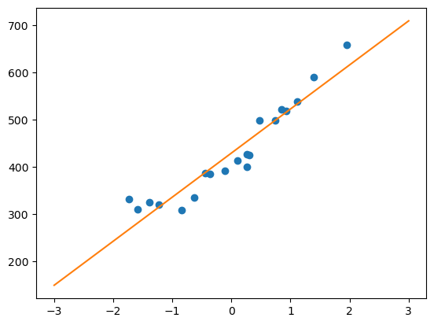

> 《白话机器学习中的数学》笔记

机器学习主要擅长包括回归、分类、以及聚类任务

**回归**是一种预测性的建模技术，用于确定一个或多个自变量（特征）与因变量（目标值）之间的关系，重点预测的是连续的数值。如根据房子的各类信息，预测房屋的价格

**分类**是将样本划分到不同的类别中，每个类别通常对应一个特定的标签，它是离散的、无序的。如根据邮件的信息判断其是否是垃圾邮件

**聚类**是将数据集中的样本划分成不同的组，使得同一组内的样本相似度高，而不同组之间的样本相似度低。聚类的结果事先是未知的，算法需要自行发现数据中的潜在结构。比如电商平台对客户进行分组，高消费、低消费等等。同时它和**分类**的区别就是它是无监督学习，而分类是有监督学习（可以认为是需要提供有正确答案的数据来学习）

这篇文章我们主要来学习一下其中的**回归**任务

<!-- more -->

## 最小二乘法

对于简单的线性变化，可以定义一个一次函数，定义如下

<div class="math">
$$
f_\theta(x) = \theta_0 + \theta_1 x
$$
</div>

假设 x 对应的实际值是 y，那么我们假设的 <span class="math">$\theta_0$</span>和<span class="math">$\theta_1$</span>计算后的值，与实际值的误差可以表示如下
<div class="math">
$$
E(\theta)=\frac 1 2 \sum_{i=1}^n{(y^{(i)} - f_\theta(x^{(i)}))}^2
$$
</div>
当我们找到 <span class="math">$\theta$</span>值可以使<span class="math">$E(\theta)$</span>的值也就是误差最小，那么这个就是求得的最佳结果

### 最速下降法

为了找到误差最小值，可以使用斜率的方式，向斜率更低的方向去寻找，找到斜率最低的点，这时候可以使用微分
<div span="class">
$$
如：g(x)=(x-1)^2=x^2-2x+1, 对应的微分为：\frac d {dx} g(x) = 2x-2
$$
</div>
这种方式可以称为最速下降法或者梯度下降法，对应公式
<div span="class">
$$
x := x - \eta \frac d {dx}g(x)
$$
</div>
其中<span class="math">$\eta$</span>表示的为学习率，设置好初始值之后，每次计算结果更新<span class="math">$x$</span>后再次计算下一个<span class="math">$x$</span>

可以简单理解为在不同区间用学习率乘以导数获取对应位置移动的距离，当在一个区间，斜率基本为0 时，也就是两次x 值基本无变化，即可认为找到了解

当设置的学习率过低时，需要学习找到最佳值的次数就会很多，过高时，会有可能直接越过了最大值，左右两侧区间来回无限循环了


现在要做的就是来计算一下斜率<span class="math">$\frac d {dx} f(x)$</span>，因为其中涉及了 <span class="math">$\theta_0$</span>和<span class="math">$\theta_1$</span>两个值，所以需要使用偏微分来分别计算
<div span="class">
$$
\theta_0 := \theta_0 - \eta \frac {\partial E} {\partial \theta_0} 
$$
</div>
<div span="class">
$$
\theta_1 := \theta_1 - \eta \frac {\partial E} {\partial \theta_1}
$$
</div>
因为<span class="math">$E$</span>中没有直接的<span class="math">$\theta$</span>值，需要通过<span class="math">$f_\theta(x)$</span>进行展开计算，比较麻烦，此时可以使用复合函数的微分，令
<div span="class">
$$
u=E(\theta)
$$
</div>
<div span="class">
$$
v = f_\theta(x)
$$
</div>
那么 <span class="math">$E$</span> 对 <span class="math">$\theta_0$</span> 的微分可以表示为：
<div span="class">
$$
\frac {\partial u} {\partial \theta_0} = \frac {\partial u} {\partial v} \cdot \frac {\partial v} {\partial \theta_0}
$$
</div>
先来计算<span class="math">$\frac {\partial u} {\partial v}$</span>
<div span="class">
$$
\begin{align}
\frac {\partial u} {\partial v} &= \frac {\partial} {\partial v}E(\theta)\\
&= \frac {\partial} {\partial v} (\frac 1 2 \sum_{i=1}^n{(y^{(i)} - f_\theta(x^{(i)}))}^2)\\
&= \frac 1 2 \sum_{i=1}^n(\frac \partial {\partial v} (y^{(i)} - v)^2)\\
&= \frac 1 2 \sum_{i=1}^n(\frac \partial {\partial v} ({y^{(i)}}^2 - 2y^{(i)}v + v^2))\\
&= \frac 1 2 \sum_{i=1}^n(-2y^{(i)} + 2v)\\
&= \sum_{i=1}^n(v-y^{(i)})
\end{align}
$$
</div>
再来计算<span class="math">$\frac {\partial v} {\partial \theta_0}$</span>
<div span="class">
$$
\begin{align}
\frac {\partial v} {\partial \theta_0} &= \frac {\partial} {\partial \theta_0} f_\theta(x)\\
&= \frac {\partial} {\partial \theta_0} (\theta_0 + \theta_1x)\\
&= 1
\end{align}
$$
</div>
最后结果
<div span="class">
$$
\begin{align}
\frac {\partial u} {\partial \theta_0} &= \frac {\partial u} {\partial v} . \frac {\partial v} {\partial \theta_0}\\
&= \sum_{i=1}^n(v-y^{(i)}) \cdot 1\\
&= \sum_{i=1}^n(f_\theta(x^{(i)}) - y^{(i)})
\end{align}
$$
</div>


同样的方法，我们来计算一下对<span class="math">$\theta_1$</span>进行微分的结果
<div span="class">
$$
\frac {\partial u} {\partial \theta_1} = \frac {\partial u} {\partial v} \cdot \frac {\partial v} {\partial \theta_1}
$$
</div>
<span class="math">$\frac {\partial u} {\partial v}$</span>之间已经计算过了，所以可以只计算<span class="math">$\frac {\partial v} {\partial \theta_1}$</span>
<div span="class">
$$
\begin{align}
\frac {\partial v} {\partial \theta_1} &= \frac \partial {\partial \theta_1}(\theta_0 + \theta_1 x)\\
&= x
\end{align}
$$
</div>
结果为
<div span="class">
$$
\begin{align}
\frac {\partial u} {\partial \theta_1} &= \frac {\partial u} {\partial v} \cdot \frac {\partial v} {\partial \theta_1}\\
&= \sum_{i=1}^n(v-y^{(i)}) \cdot x^{(i)}\\
&= \sum_{i=1}^n(f_\theta(x^{(i)}) - y^{(i)}) \cdot x^{(i)}\\
\end{align}
$$
</div>


此时之前的<span class="math">$\theta_0$</span>和<span class="math">$\theta_1$</span>两个表达式可以改为
<div span="class">
$$
\begin{align}
\theta_0 &:= \theta_0 - \eta \sum_{i=1}^n(f_\theta(x^{(i)}) - y^{(i)}) & \\
\theta_1 &:= \theta_1 - \eta \sum_{i=1}^n(f_\theta(x^{(i)}) - y^{(i)}) \cdot x^{(i)} & \\
\end{align}
$$
</div>

此时可以设定初始学习率后不断开始学习计算，直到获取一个比较理想的结果


## 多项式回归

直线的拟合可以使用之前的最小二乘法，这次看一下曲线的拟合，定义如下的二次函数
<div span="class">
$$
f_\theta(x) = \theta_0 + \theta_1x + \theta_2x^2
$$
</div>

对于<span class="math">$u$</span>、<span class="math">$v$</span>的值保持不变
<div span="class">
$$
\frac {\partial u} {\partial \theta_2} = \frac {\partial u} {\partial v} \cdot \frac {\partial v} {\partial \theta_2}
$$
</div>

之前计算过的<span class="math">$\frac {\partial u} {\partial v}$</span>的结果为<span class="math">$\sum_{i=1}^n(v-y^{(i)})$</span>，这里需要对剩下的<span class="math">$\frac {\partial v} {\partial \theta_2}$</span>进行计算
<div span="class">
$$
\begin{align}
\frac {\partial v} {\partial \theta_2} &= \frac {\partial} {\partial \theta_2}(f_\theta(x))\\
&= \frac {\partial} {\partial \theta_2}(\theta_0 + \theta_1x + \theta_2x^2)\\
&= x^2
\end{align}
$$
</div>
最终<span class="math">$\theta_2$</span>的计算方式为
<div span="class">
$$
\theta_2 := \theta_2 - \eta\sum_{i=1}^n(f_\theta(x^{(i)}) - y^{(i)})x^{(i)^2}
$$
</div>


## 多重回归

之前是只有一个变量的情况，当变量增多时，如下述公式
<div span="class">
$$
f_\theta(x1, x2, x3) = \theta_0 + \theta_1x_1 + \theta_2x_2 + \theta_3x_3
$$
</div>
这种写法当<span class="math">$x$</span>有很多时，如<span class="math">$x_1,x_2,x_3,x_4,x_5...x_n$</span>写起来会很麻烦，这时候可以采用向量的表示方式
<div class="math">
$$
\boldsymbol{\theta} =
\begin{bmatrix}
\theta_0 \\
\theta_1 \\
\theta_2 \\
...\\
\theta_n
\end{bmatrix}
$$
</div>
<div class="math">
$$
\boldsymbol{x}=
\begin{bmatrix}
1 \\
x_1 \\
x_2 \\
...\\
x_n
\end{bmatrix}
$$
</div>
则表达式可以表示为<span class="math">$\boldsymbol{\theta}$</span>转置之后与<span class="math">$\boldsymbol{x}$</span>相等
<div span="class">
$$
\begin{align}
\boldsymbol{\theta}^T\boldsymbol{x} &= \theta_0x_0+\theta_1x_1+\theta_2x_2+...+\theta_nx_n & \\
f_\boldsymbol{\theta}(\boldsymbol{x}) &= \boldsymbol{\theta}^T\boldsymbol{x} &\\
\end{align}
$$
</div>
保留之前设置的<span class="math">$u=E(\theta)$</span>及<span class="math">$v=f_\theta(x)$</span>，对于第<span class="math">$j$</span>个元素<span class="math">$\theta_j$</span>偏微分表达式为
<div span="class">
$$
\frac {\partial u} {\partial \theta_j} = \frac {\partial u} {\partial v} \cdot \frac {\partial v} {\partial \theta_j}
$$
</div>
开始计算
<div span="class">
$$
\begin{align}
\frac {\partial v} {\partial \theta_j} &= \frac \partial {\partial \theta_j}(f_\theta(x))\\
&= \frac \partial {\partial \theta_j}(\theta_0x_0+\theta_1x_1+... + \theta_jx_j + ... +\theta_nx_n)\\
&= x_j
\end{align}
$$
</div>
那么第<span class="math">$j$</span>个参数的更新表达式为
<div span="class">
$$
\theta_j := \theta_j - \eta\sum_{i=1}^n(f_\theta(x^{(i)})-y^{(j)})x_j^{(i)}
$$
</div>


## 随机梯度下降法

最速下降法计算量大、计算时间长，同时容易陷入局部最优解（在某一个区间有一个最低点，但不是全局最低点，如果从这里附近开始，沿梯度下降方式寻找，可能只能找到这个局部最优解）

之前的公式中每次计算会把<span class="math">$i=1$</span>到<span class="math">$n$</span>期间的所有值都计算一遍，而在随机梯度下降法中，会随机选择一个训练数据，如选择一个 <span class="math">$k$</span>
<div span="class">
$$
\theta_j := \theta_j - \eta(f_\theta(x^{(k)})-y^{(k)})x_j^{(k)}
$$
</div>
我们也可以选择多个数据，来一起计算，也会减少一定的计算量，如选择<span class="math">$m$</span>个训练数据的索引集合为<span class="math">$K$</span>，这种做法被称为小批量梯度下降法
<div span="class">
$$
\theta_j := \theta_j - \eta\sum_{k \in K}(f_\theta(x^{(k)})-y^{(k)})x_j^{(k)}
$$
</div>

## Python实现

### 最小二乘法

#### 测试数据准备

测试数据 `click.csv`

```csv
x,y
235,591
216,539
148,413
35,310
85,308
204,519
49,325
25,332
173,498
191,498
134,392
99,334
117,385
112,387
162,425
272,659
159,400
159,427
59,319
198,522
```

现在通过代码实现来拟合成一条直线

#### 数据标准化（可选）

在正式处理之前，我们可以提前对数据进行一下标准化，这样可以让模型的收敛速度更快

标准化（标准差标准化或者叫Z-Score 标准化）的公式如下
$$
z^{(i)}=\frac {x^{(i)} - u}  \sigma
$$
其中<span class="math">$u$</span>是训练数据的平均值，<span class="math">$\sigma$</span>是标准差，标准差的计算公式如下
$$
\sigma = \sqrt \frac {\sum_{(i=1)}^n(x_i - u)^2} {n}
$$

```python
# 平均值及标准差的计算 numpy 中已经提供了方法
import numpy as np
import matplotlib.pyplot as plt

train = np.loadtxt('click.csv', delimiter=',', skiprows=1)
# 第一列，左侧数据
train_x = train[:,0]
# 第二列，右侧数据
train_y = train[:,1]

# 现在来对x进行标准化
# 计算平均值
mu = train_x.mean()
# 计算标准差
sigma = train_x.std()
# 定义标准化函数
def standardize(x):
    return (x - mu) / sigma

train_z = standardize(train_x)
```

这时候可以根据之前定义的<span class="math">$\theta_0$</span>和<span class="math">$\theta_1$</span>的更新表达式来进行计算，即

<div class="math">
$$
\begin{align}
\theta_0 &:= \theta_0 - \eta \sum_{i=1}^n(f_\theta(x^{(i)}) - y^{(i)}) & \\
\theta_1 &:= \theta_1 - \eta \sum_{i=1}^n(f_\theta(x^{(i)}) - y^{(i)}) \cdot x^{(i)} & \\
\end{align}
$$
</div>

#### 计算参数

```python
# 随机初始化函数中的两个参数
theta0 = np.random.rand()
theta1 = np.random.rand()

# 生成随机参数后，拟合函数如下
def f(x):
    return theta0 + theta1 * x

# 误差函数(我们要找个这个函数最小的情况下的theta0 和theta1 的值)
def E(x, y):
    return 0.5 * np.sum(y - f(x) ** 2)

# 定义学习率
ETA = 1e-3
# 误差值(两次误差的差值，判断变化幅度)
diff = 1

# 开始学习(先计算初始的误差)
error = E(train_z, train_y)
# 如果两次误差差值过大则继续计算
while diff > 1e-2:
    # 开始计算更新
    theta0 = theta0 - ETA * np.sum((f(train_z) - train_y))
    theta1 = theta1 - ETA * np.sum((f(train_z) - train_y) * train_z)

    # 计算误差差值
    current_error = E(train_z, train_y)
    error, diff = current_error, error - current_error


# 学习完成后，绘制拟合结果
x = np.linspace(-3, 3, 100)
plt.plot(train_z, train_y, 'o')
plt.plot(x, f(x))
plt.show()
```




## 总结

具体总的流程可以总结为

1. 确定误差函数，需要找到当其结果最小时，其他参数的值
2. 确定误差函数的偏/微分
3. 确定梯度下降公式（可以简单理解为，先随机取一个值，然后向误差函数结果值偏小的方向去移动，重新计算，直至移动后，结果变化差值为0或基本无变化，可以认为达到了误差最小值）
4. 使用梯度下降公式重复计算，直至获取结果
