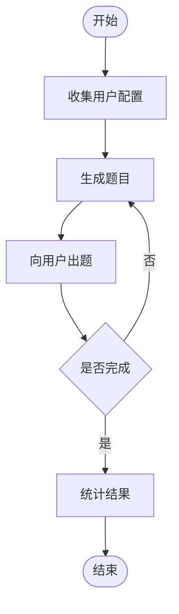

在工程讨论中，一旦提到「大模型应用开发」，立即就会出现一大堆的概念：LangChain / LangGraph、Agent Loop、Tool Calling、Memory 管理、Planning 策略、Orchestration 等等

但现实项目中，大量需求并没有复杂到需要构建运行时系统，很多场景只是希望可以封装一个能力、提供一个结构化的交互，同时可以被稳定复用

对于这类问题，更务实的路径是：不要从零构建 Agent，而是基于通用Agent 进行扩展 —— 通过编写Skills

本文将通过一个真实示例说明，如何仅通过定义一个 Skill，就实现一个完整可用的小型大模型应用

<!-- more -->

## Agent Skills 在应用生态中的位置

理解 Skills 的价值，需要把它放在更大的构建路径坐标系中，大模型应用开发大致存在三种层级方式：


### Prompt级使用

基本都是单次交互、行为无结构、难以复用且不具备应用形态

适合探索，但难以工程化


### Skills 扩展（本文关注）

用来定义能力行为，可以描述交互流程，能被 Agent 自动调度，同时可复用与迭代

其本质变化是：我们不再编写 Prompt，而是在定义能力模块

Skills 可以理解为，在为通用 Agent 提供行为级的能力描述

通常包含：触发场景、能力声明、工作流程

它既不是 Prompt 模板，也不是工具函数，而是一个可被调度执行的行为单元


### 自建 Agent Runtime

完全控制执行逻辑：自己处理Tool routing、Context 生命周期、进行状态管理以及规划策略

最灵活但同时成本也是最高的


所以可以看出，大模型应用不只有一种构建方式，构建 Agent 只是投入最高的一种。而对于大量中小型场景，Skills 已足以承载应用逻辑


## 为什么小应用不应从零构建 Agent

构建 Agent 系统的成本往往被低估。实际需要解决如工具调用决策、上下文裁剪、状态持久化、多轮规划、异常恢复等等，这些都属于系统工程，而非应用能力开发

如果应用满足：单一能力闭环、有限交互流程且不涉及复杂协作，那么从零构建 Agent 通常属于过度设计

更合理的策略是：利用现成通用 Agent 执行环境，仅扩展所需能力，而这正是 Skills 的价值所在


## 实战：构建英语翻译练习应用

下面通过一个简单示例展示 Skills 的应用形态

目标：实现一个结构化翻译练习流程，包括：

- 用户配置
- 多轮交互
- 难度控制
- 表现反馈

这已经具备典型应用闭环。



具体的SKILL.md 代码在最后部分提供，这里可以截图展示一下具体使用效果：

用户选择信息：


用户回答：


大模型点评：


### 能力声明设计

Skill 的 description 决定 Agent 是否调用该能力。
它相当于：能力索引及调度入口

设计时需要明确：使用场景、行为目标及交互形式

声明这一步实际上是在定义应用边界


### 工作流结构设计

该 Skill 被拆分为三个阶段：

#### 配置阶段

收集翻译方向、难度、场景与题量，完成初始化

#### 执行阶段

逐题交互、动态生成内容并推进状态流程

#### 总结阶段

统计结果并给出改进建议，形成学习闭环

这种拆分体现的是：

- 会话结构设计
- 用户体验控制
- 行为节奏管理

这已经已经可以算是应用设计了


## Skills 模式的工程价值

从工程角度看，这种模式具有明显优势

- 开发成本极低：无需实现运行时系统

- 迭代速度极快：行为更新只需修改 Skill 定义

- 可复用性强：同一 Skill 可运行在不同 Agent 环境

- 非常适合 MVP 阶段：验证产品想法成本最低

这使其成为进入 LLM 应用开发的理想入口


## 何时升级为自建 Agent

Skills 并非终点，当出现以下需求时，应考虑升级架构：

- 多技能复杂协作
- 长期状态管理
- 深度工具系统集成
- 需要自定义规划控制

所以正确的理解是：Skills 是应用演化路径的起点，而不是替代方案


## 结语

大模型应用开发的门槛，往往来自对复杂架构的过早投入，而Agent Skills 提供了一种更务实的入口：**从构建系统转向定义能力**

对于许多场景而言，这已经足以交付价值，如果你尚未构建过 LLM 应用，不妨从编写一个 Skill 开始

你可能会发现，进入门槛远比想象中低得多


## 附录

英语翻译练习`SKILL.md`，如果有兴趣，可以继续迭代～

```markdown
---
name: english-translation-practice
description: This skill should be used when the user wants to practice English translation. It provides a structured translation practice session with customizable settings including translation direction, difficulty level, scenario, and number of questions. After completing the practice, it gives feedback and persists user performance data for future sessions.
---

# 英语翻译练习

## 概述

该技能为用户提供结构化、交互式的英语翻译练习体验。用户可以通过选择以下选项自定义练习：
- 翻译方向（中文到英文或英文到中文）
- 难度级别（简单、中等、困难）
- 场景（日常生活、商务、旅行、教育）
- 题目数量

## 工作流程

### 1. 用户配置选择
使用 AskUserQuestion 工具收集用户偏好：
1. 翻译方向：中文 → 英文 或 英文 → 中文
2. 难度级别：简单、中等或困难
3. 场景：日常生活、商务、旅行或教育
4. 题目数量：5、10、15或20

### 2. 练习会话
- 根据用户上一步选择的信息来生成对应的题目
- 逐一提供对应的原始翻译文本
- 用户回答完成一题后，出下一道题目

### 3. 反馈和总结
完成所有题目后：
- 显示练习会话的详细摘要
- 计算准确率
- 根据用户表现提供针对性的学习或者练习建议

```


