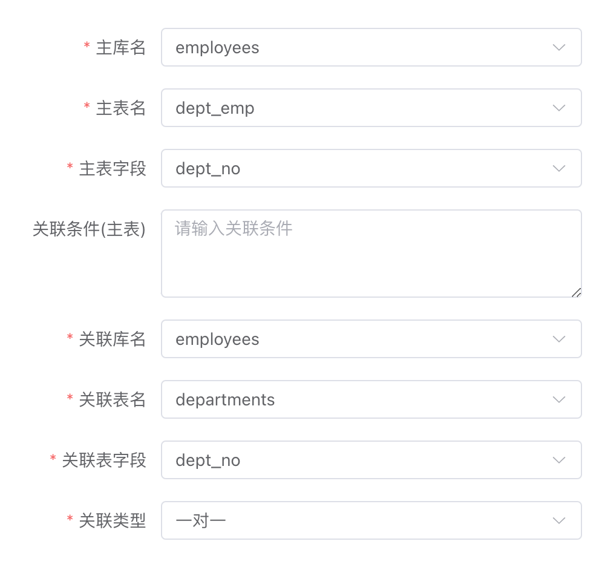
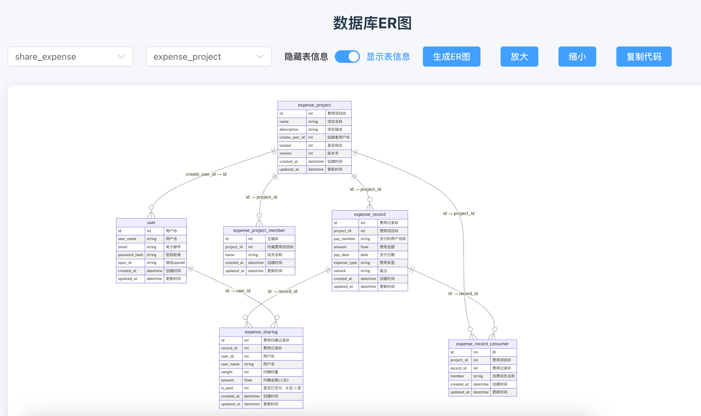
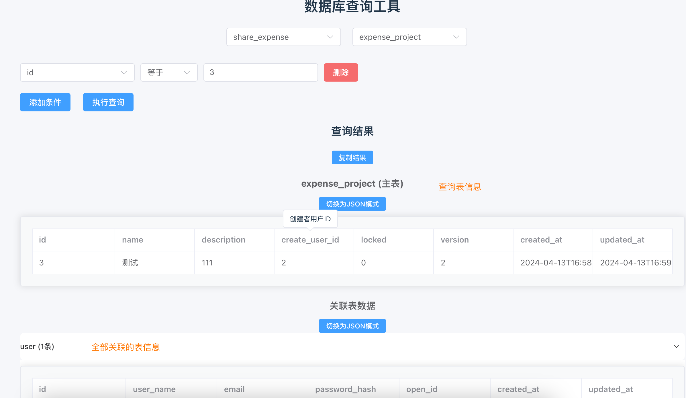

对于复杂的一些业务，会涉及很多张表，其间有各种各样的关联关系，在开发&测试过程中，随时需要查看这些表中的数据状态，这种情况下需要我们写一些关联查询的SQL或者多条SQL执行来查看结果，个人感觉用起来还是不太方便，所以决定开发一个关联表自动进行查询的工具

后端基于spring boot自行开发；前端部分使用了Trae，让大模型来进行的开发～

[后端项目代码](https://github.com/zavier/table-relation)、 [前端项目代码](https://github.com/zavier/table-relation-front)、 [体验地址](https://zhengw-tech.com/table/index.html)

<!-- more -->

服务主要还是本地部署，个人使用，所以有如下特点

1. 没有处理相关的SQL注入!
2. 本地数据库使用sqlite文件格式存储，没有使用单独的mysql等服务
3. 目前使用是将前端构建后的结果复制到后端项目中进行使用

下面进行一下对应功能介绍

### 数据源管理

用来管理数据库的连接（需要服务所在的机器可以连接到数据库）

### 表字段关系管理

这里主要进行字段关系的维护，如果使用了外键的话，其实是可以自动同步外键配置的，不过目前项目中使用较少，所以没有进行支持实现，后续可考虑增加此功能

比如员工表(employees)的部门编码字段(dept_no)对应了，部门表(departments)的(dept_no)字段，那么我们可以这样配置（主表可以理解为包含类似外键的表）

其中的关联条件部分，使用场景为一张表根据条件关联不同的表

假设有多张表，它们的操作日志都记录在了一个叫做操作日志的表里面，同时操作日志表有一个类型字段来区分对应的表是哪个，那么我们可以在关联条件中输入对应的条件即可，如（type=1），如果没有这种场景就可以不填写

### ER图查看

在创建好数据源以及维护好字段关系后，我们可以通过查看ER图来确认一下配置是否正确

需要输入一下对应的db和table即可，会查找所有关联的表进行展示，并同时展示关联的字段关系

### 数据查询

最后就是数据的查询，选择db和表后，需要输入对应的查询条件，这时会查询对应的数据，同时会将关联的表和数据同时在下方进行展示（目前限制了单表数据最多10条）

