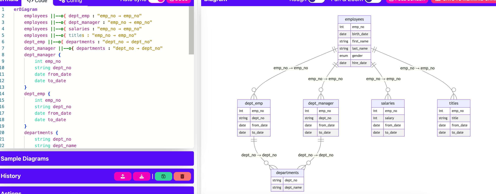
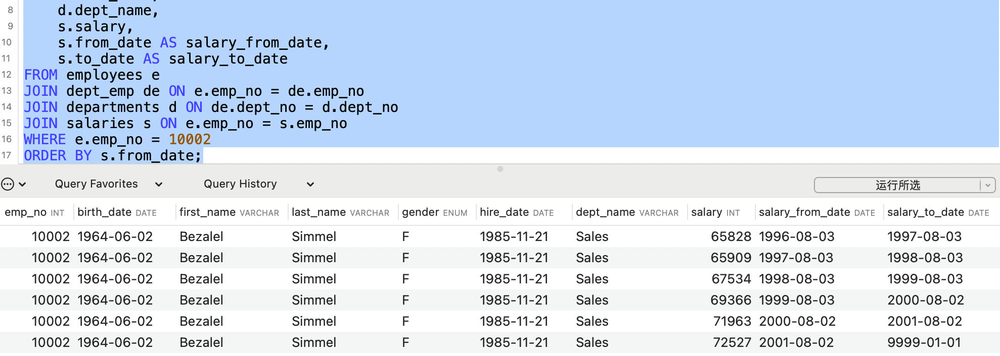

对于复杂的一些业务，会涉及很多张表，其间有各种各样的关联关系，在开发&测试过程中，随时需要查看这些表中的数据状态，这种情况下需要我们写一些关联查询的SQL或者多条SQL执行来查看结果，个人感觉用起来还是不太方便，所以想开发一个关联表自动进行查询的工具

后端基于spring boot自行开发；前端部分使用了Trae，让大模型来进行的开发～

[后端项目代码](https://github.com/zavier/table-relation)、 [前端项目代码](https://github.com/zavier/table-relation-front)、 [体验地址](https://zhengw-tech.com/table/index.html)

<!-- more -->

服务主要还是本地部署个人使用，为了简化，本地数据库使用了sqlite的文件形式存储，同时采用了将前端项目打包结果复制到后端项目中同步部署，所以没有其他任务外部依赖

在后端项目中启动后，直接访问 `http://域名:端口/table/index.html` 即可使用，或者打包后通过 `java -jar xxx.jar` 执行

注意：

1. 需要 jdk 版本大于等于 21

1. 没有做鉴权及SQL注入等处理，所以只建议本地安装个人使用

下面进行一下对应功能介绍

### 数据源管理

用来管理数据库的连接（需要服务所在的机器可以连接到数据库）


### 表字段关系管理

这里主要进行字段关系的维护，如果使用了外键的话，其实是可以自动同步外键配置的，不过目前项目中使用较少，所以没有进行支持实现，后续可考虑增加此功能


比如员工表(employees)的部门编码字段(dept_no)对应了，部门表(departments)的(dept_no)字段，那么我们可以这样配置（主表可以理解为包含类似外键的表）

其中的关联条件部分，使用场景为一张表根据条件关联不同的表

假设有多张表，它们的操作日志都记录在了一个叫做操作日志的表里面，同时操作日志表有一个类型字段来区分对应的表是哪个，那么我们可以在关联条件中输入对应的条件即可，如（type=1），如果没有这种场景就可以不填写


### ER图查看

在创建好数据源以及维护好字段关系后，我们可以通过查看ER图来确认一下配置是否正确

需要输入一下对应的db和table即可，会查找所有关联的表进行展示，并同时展示关联的字段关系


### 数据查询

最后就是数据的查询，选择db和表后，需要输入对应的查询条件，这时会查询对应的数据，同时会将关联的表和数据同时在下方进行展示（目前限制了单表数据最多10条）


### 后续扩展

在有个表关系的ER图后，我们可以比较容易的让大模型来帮助我们根据自然语言来生成查询SQL了

将memaid格式的ER图文本和自然语言提供给大模型即可，这里举一个小例子(langchain)：

```python
class ExecutableSql(BaseModel):
    """可执行的SQL信息"""
    sql: str = Field(description="查询结果的SQL语句")

def sql_generation(er_diagram: str, description: str, llm: BaseChatModel) -> str:
    """
    根据用户的请求，和er图，生成最终的SQL语句
    """

    # 构造解析器
    parser = PydanticOutputParser(pydantic_object=ExecutableSql)
    # 构造提示词模版
    prompt = PromptTemplate(
        template="根据如何mermaid格式的ER图:\n{er_diagram}\n\n为这个请求生成SQL查询语句:\n{description}\n\n，{format_instructions}\n",
        input_variables=["description", "er_diagram"],
        partial_variables={"format_instructions": parser.get_format_instructions()},
    )

    # 将提示此、llm、结果解析器构造成链
    chain = prompt | llm | parser
    # 使用参数实际调用获取结果
    sqlInfo = chain.invoke({"er_diagram": er_diagram, "description": description})
    return sqlInfo.sql
```

这里使用了mysql 例子中的employees数据库来实际看下，生成的ER图如下：



将左侧ER图的文本和问题，如：`查询一下员工编号为10002的基本信息、所在部门，以及不同时间对应的薪资情况`提供给大模型，可以得到如下结果：

```sql
SELECT 
    e.emp_no,
    e.birth_date,
    e.first_name,
    e.last_name,
    e.gender,
    e.hire_date,
    d.dept_name,
    s.salary,
    s.from_date AS salary_from_date,
    s.to_date AS salary_to_date
FROM employees e
JOIN dept_emp de ON e.emp_no = de.emp_no
JOIN departments d ON de.dept_no = d.dept_no
JOIN salaries s ON e.emp_no = s.emp_no
WHERE e.emp_no = 10002
ORDER BY s.from_date;
```

我们实际执行一下，获取结果：




